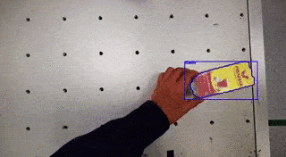

# **easy_perception_deployment**
[](https://github.com/ros-industrial/easy_perception_deployment/actions/workflows/industrial_ci_action.yml)
[](https://codecov.io/gh/ros-industrial/easy_perception_deployment)
[](https://opensource.org/licenses/Apache-2.0)
[](https://epd-docs.readthedocs.io/en/latest/?badge=latest)


## **What Is This?**

**easy_perception_deployment** is a ROS2 package that accelerates the **training** and **deployment** of **Computer Vision** (CV) models for industries.





## **Quality Declaration**

This package claims to be in the **Quality Level 4** category, see the [**Quality Declaration**](https://github.com/cardboardcode/easy_perception_deployment/blob/master/QUALITY_DECLARATION.md) for more details.

## **Install (Ubuntu 22.04 + ROS 2 Humble)**

This section lists reproducible steps to build and run **easy_perception_deployment** on Ubuntu 22.04 (Jammy) with ROS 2 Humble.

```bash
# 1) Base tools + ROS build dependencies
sudo apt update
sudo apt install -y \
  curl \
  git \
  python3-colcon-common-extensions \
  python3-rosdep \
  python3-vcstool \
  ros-humble-vision-opencv \
  ros-humble-cv-bridge \
  ros-humble-pcl-conversions \
  ros-humble-sensor-msgs \
  ros-humble-message-filters \
  ros-humble-geometry-msgs \
  ros-humble-tf2 \
  libopencv-dev \
  libjsoncpp-dev

# 2) Initialize rosdep once per machine
sudo rosdep init || true
rosdep update

# 3) Create workspace and clone EPD
mkdir -p "$HOME/epd_ros2_ws/src"
cd "$HOME/epd_ros2_ws/src"
git clone https://github.com/Mukaram01/epd_Improved.git .

# Optional: import ONNX Runtime vendor repos used by this project
vcs import < easy_perception_deployment/onnxruntime.repos

# 4) Install package dependencies
cd "$HOME/epd_ros2_ws"
source /opt/ros/humble/setup.bash
rosdep install --from-paths src --ignore-src -r -y

# 5) Build and source
colcon build --symlink-install --cmake-args -DEPD_DOWNLOAD_MODELS=ON
source install/setup.bash
```

Start the GUI workflow (downloads models and sets up the conda env as needed):

```bash
cd "$HOME/epd_ros2_ws/src/easy_perception_deployment/easy_perception_deployment"
bash run.bash
```

## **RealSense setup (D435i)**

On Ubuntu 22.04 + ROS 2 Humble, two RealSense issues are common:

1. **`iio-sensor-proxy` conflicts with IMU streams** (gyro/accel topics may fail).
2. **Linux permissions** block camera access for non-root users.

Apply both fixes:

```bash
# 1) Stop iio-sensor-proxy and prevent it from restarting
sudo systemctl stop iio-sensor-proxy.service
sudo systemctl disable iio-sensor-proxy.service
sudo systemctl mask iio-sensor-proxy.service

# 2) Grant camera-related device access to your user
sudo usermod -aG video,plugdev,input "$USER"

# Re-login (or reboot) after changing groups
```

Quick verification checklist:

```bash
# A) Device nodes exist (and are group-readable)
ls -l /dev/video*

# B) RealSense camera node launches with IMU enabled
source /opt/ros/humble/setup.bash
ros2 launch realsense2_camera rs_launch.py \
  enable_gyro:=true \
  enable_accel:=true

# C) Topics use /camera/camera prefix (expected with rs_launch.py)
ros2 topic list | grep /camera/camera
```

## **Run EPD node with RealSense topics**

Default RealSense topic names expected in this setup are:

* `/camera/camera/color/image_raw`
* `/camera/camera/color/camera_info`
* `/camera/camera/depth/image_rect_raw` (or aligned depth when available)

EPD supports two ways to connect these topics without creating new launch files.

### **Option 1 (preferred): pass launch arguments**

`easy_perception_deployment/launch/run.launch.py` already provides `rgb_topic`, `camera_info_topic`, and `depth_topic` arguments:

```bash
source /opt/ros/humble/setup.bash
source "$HOME/epd_ros2_ws/install/setup.bash"

ros2 launch easy_perception_deployment run.launch.py \
  rgb_topic:=/camera/camera/color/image_raw \
  camera_info_topic:=/camera/camera/color/camera_info \
  depth_topic:=/camera/camera/depth/image_rect_raw
```

If aligned depth is available, set:

```bash
depth_topic:=/camera/camera/aligned_depth_to_color/image_raw
```

### **Option 2: ROS remaps at launch-time**

You can also remap EPD defaults directly in the launch command:

```bash
source /opt/ros/humble/setup.bash
source "$HOME/epd_ros2_ws/install/setup.bash"

ros2 launch easy_perception_deployment run.launch.py --ros-args \
  -r /camera/color/image_raw:=/camera/camera/color/image_raw \
  -r /camera/color/camera_info:=/camera/camera/color/camera_info \
  -r /camera/depth/image_rect_raw:=/camera/camera/depth/image_rect_raw \
  -r /camera/aligned_depth_to_color/image_raw:=/camera/camera/aligned_depth_to_color/image_raw
```

> **Common mistakes**
>
> * `ros2 topic hz /camera/color/image_raw` is usually wrong for RealSense with `rs_launch.py` because it misses the `/camera/camera` prefix.
> * `/camera/imu` typically does not exist for this setup. Use:
>   * `/camera/camera/gyro/sample`
>   * `/camera/camera/accel/sample`

## **run.bash notes**

`run.bash` is hardened for shells that use `set -u` (nounset). Older copies could fail with:

```text
AMENT_TRACE_SETUP_FILES: unbound variable
```

Pull the latest branch before running so you get robust ROS setup sourcing:

```bash
cd "$HOME/epd_ros2_ws/src/easy_perception_deployment"
git pull
```

Environment variables recognized by `run.bash`:

* `EPD_WS`: workspace root used to find `install/setup.bash`.
* `EPD_SKIP_DOWNLOAD`: set to `1` to skip automatic model downloads.
* `ROS_DISTRO`: ROS distro used when sourcing `/opt/ros/<distro>/setup.bash` (defaults to `humble`).

## **Model Downloads**

The build requires pretrained ONNX models stored in:

```
easy_perception_deployment/data/model/
```

If you do not enable downloads at configure time, you can fetch them manually from the repository root:

```bash
mkdir -p easy_perception_deployment/data/model
curl -L "https://github.com/onnx/models/raw/main/validated/vision/classification/squeezenet/model/squeezenet1.1-7.onnx" -o "easy_perception_deployment/data/model/squeezenet1.1-7.onnx"
curl -L "https://github.com/onnx/models/raw/main/validated/vision/object_detection_segmentation/faster-rcnn/model/FasterRCNN-10.onnx" -o "easy_perception_deployment/data/model/FasterRCNN-10.onnx"
curl -L "https://github.com/onnx/models/raw/main/validated/vision/object_detection_segmentation/mask-rcnn/model/MaskRCNN-10.onnx" -o "easy_perception_deployment/data/model/MaskRCNN-10.onnx"
```

Alternatively, run the helper script:

```bash
./scripts/download_models.sh
```

If you prefer configure-time downloads, add the CMake option:

```bash
colcon build --cmake-args -DEPD_DOWNLOAD_MODELS=ON
```

## **Dependencies (Humble/Ubuntu 22.04)**

Install the core vision stack and ROS image-related dependencies that EPD uses (OpenCV, cv_bridge, and ROS image messages) via apt:

```bash
sudo apt update
sudo apt install -y \
  ros-humble-vision-opencv \
  ros-humble-cv-bridge \
  ros-humble-pcl-conversions \
  ros-humble-sensor-msgs \
  ros-humble-message-filters \
  ros-humble-geometry-msgs \
  ros-humble-tf2 \
  libopencv-dev \
  libjsoncpp-dev
```

Fetch the ONNX Runtime vendor package from `onnxruntime.repos` (it should build on Ubuntu 22.04). If the vendor build fails, make sure standard build prerequisites are installed:

```bash
sudo apt update
sudo apt install -y build-essential cmake python3-dev python3-pip
vcs import < easy_perception_deployment/onnxruntime.repos
```

The GUI is built with **PySide6**. If you are using the included `run.bash` workflow, it installs PySide6 into a conda environment. For a system Python install, use pip:

```bash
python3 -m pip install --user PySide6
```
## **Precision Levels & Model Selection**

Use the **ONNX Model** selector in the Deploy window (see `gui/windows/Deploy.py`) to choose a detector that matches your throughput target. Place ONNX model files in `easy_perception_deployment/easy_perception_deployment/data/model/` (or any path you prefer) and point the GUI to the file. The default session config (`config/session_config.json`) is set to a lightweight SSD MobileNet model for CPU throughput.

| Precision Level | Expected Tradeoff | Example Models (ONNX) | Notes |
| --- | --- | --- | --- |
| 1 (Fastest) | Highest speed, lowest accuracy | `ssd_mobilenet_v1_12.onnx` | Good CPU baseline; included via `run.bash` download. |
| 2 (Balanced) | Medium speed, medium accuracy | `yolov5s.onnx` (user-provided) | Place in `data/model/` and select in GUI. |
| 3 (Most Accurate) | Lowest speed, highest accuracy | `FasterRCNN-10.onnx`, `MaskRCNN-10.onnx` | Larger models, best accuracy; downloaded by `run.bash`. |

To switch models, open the Deploy window and click **ONNX Model** to pick the appropriate file. The selected path is persisted in `config/session_config.json` for subsequent runs.

## **Throughput Tuning**

For CPU-bound deployments, start by selecting a lighter detector using the **ONNX Model** button in the Deploy window (`gui/windows/Deploy.py`). Pair that with the `useCPU` and threading settings in `config/session_config.json` to balance throughput and latency. If you need more accuracy, move up to Precision Level 2 or 3 models and reassess performance.
Wayland note: on Wayland sessions, set the Qt backend to X11 by exporting `QT_QPA_PLATFORM=xcb`
(for example, `export QT_QPA_PLATFORM=xcb`) before launching the GUI.

## **Docs**

[Check out the full documentation here.](https://easy-perception-deployment.readthedocs.io/en/latest/)

## **Image Transport Configuration**

EPD can subscribe/publish using ROS image transport plugins. Set
`image_transport` in `config/session_config.json` (or override via ROS params)
to switch between raw and compressed image topics.

**Recommended settings for high-rate pipelines**
* Set `"visualizeFlag": "robot"` to reduce visualization overhead.
* Set `"image_transport": "compressed"` to reduce RGB bandwidth.
* Depth inputs automatically map `compressed` to the `compressedDepth` transport.

**Session config example**
```json
{
  "path_to_model": "./data/model/MaskRCNN-10.onnx",
  "path_to_label_list": "./data/label_list/coco_classes.txt",
  "visualizeFlag": "robot",
  "useCPU": "CPU",
  "intra_op_num_threads": 0,
  "image_transport": "compressed"
}
```

**ROS parameter override**
```bash
ros2 run easy_perception_deployment easy_perception_deployment \
  --ros-args -p image_transport:=compressed
```

When `image_transport` is set to `compressed`, EPD expects:
* `/easy_perception_deployment/image_input/compressed`
* `/camera/color/image_raw/compressed` (localization/tracking RGB)
* `/camera/depth/image_rect_raw/compressedDepth` (localization/tracking depth)

Visualization output uses the same transport, so subscribe to
`/easy_perception_deployment/image_output/compressed` as needed.
## **Use Cases & ROS 2 Outputs**

EPD supports multiple use cases via `config/usecase_config.json`:

* **Classification (usecase_mode = 0)**: Runs standard detection and publishes per-object labels and ROIs on the P2/P3 topics (see below). This mode does **not** run a standalone image-classification (P1) model yet; those models currently do not emit ROS 2 outputs in this repo.
* **Counting (usecase_mode = 1)**: Filters detections to user-selected classes for counting.
* **Color-Matching (usecase_mode = 2)**: Filters detections based on a reference color template.
* **Localization (usecase_mode = 3)**: Requires a P3 model and depth + camera info topics.
* **Tracking (usecase_mode = 4)**: Requires a P3 model and depth + camera info topics.

Key ROS 2 topics:

* `/easy_perception_deployment/epd_p2_output` (P2 detections) and `/easy_perception_deployment/epd_p3_output` (P3 detections).
* `/easy_perception_deployment/epd_localize_output` for localization (3D centroids, dimensions, masks, and point clouds).
* `/easy_perception_deployment/epd_tracking_output` for tracking.
* `/easy_perception_deployment/epd_pose_output` for a `geometry_msgs/PoseArray` of 3D object poses in the camera frame (position from the localized centroid; orientation aligns +X with the LocalizedObject axis derived from PCA, +Z with the camera optical axis, and +Y to complete a right-handed frame).

## **Contributions & Feedback**

**We welcome contributions!** Please see the [contribution guidelines](https://github.com/ros-industrial/easy_perception_deployment/blob/master/CONTRIBUTING.md).

For **feature requests** or **bug reports**, please file a [GitHub Issue](https://github.com/ros-industrial/easy_perception_deployment/issues).

For **general discussion** or **questions**, please use [GitHub Discussions](https://github.com/ros-industrial/easy_perception_deployment/discussions).

## **Acknowledgements**

We would like to acknowledge the Singapore government for their vision and support to start this ambitious research and development project, "Accelerating Open Source Technologies for Cross Domain Adoption through the Robot Operating System". The project is supported by Singapore National Robotics Programme (NRP).

Any opinions, findings and conclusions or recommendations expressed in this material are those of the author(s) and do not reflect the views of the NR2PO.
