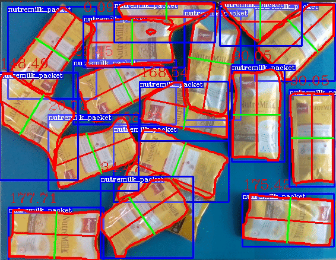

# **easy_perception_deployment**
[](https://github.com/ros-industrial/easy_perception_deployment/actions/workflows/industrial_ci_action.yml)
[](https://codecov.io/gh/ros-industrial/easy_perception_deployment)
[](https://opensource.org/licenses/Apache-2.0)
[](https://epd-docs.readthedocs.io/en/latest/?badge=latest)


## **What Is This?**

**easy_perception_deployment** is a ROS2 package that accelerates the **training** and **deployment** of **Computer Vision** (CV) models for industries.




## **Quality Declaration**

This package claims to be in the **Quality Level 4** category, see the [**Quality Declaration**](https://github.com/cardboardcode/easy_perception_deployment/blob/master/QUALITY_DECLARATION.md) for more details.

## **Setup**

This section lists steps on how to build **easy_perception_deployment** package using ROS2 build tools. The instructions assume ROS 2 Humble on Ubuntu 22.04 (Jammy).

``` bash
# Create ROS2 workspace
cd $HOME
mkdir -p epd_ros2_ws/src && cd epd_ros2_ws/src

# Download fast and shallow copy of easy_perception_deployment
git clone https://github.com/ros-industrial/easy_perception_deployment.git

# Fetch vendor dependencies (onnxruntime + jsoncpp)
vcs import < easy_perception_deployment/onnxruntime.repos

# Install dependencies
cd $HOME/epd_ros2_ws/
source /opt/ros/humble/setup.bash
rosdep install --from-paths src --ignore-src -y

# If jsoncpp_vendor is installed system-wide, point CMake at the install prefix
# that contains jsoncpp_vendorConfig.cmake (typically <prefix>/share/jsoncpp_vendor).
export CMAKE_PREFIX_PATH="<prefix>:$CMAKE_PREFIX_PATH"
# Alternatively:
# export jsoncpp_vendor_DIR="<prefix>/share/jsoncpp_vendor"

# Build the ROS2 workspace
colcon build

# Start up GUI interface.
cd src/easy_perception_deployment/easy_perception_deployment
bash run.bash
```

## **Precision Levels & Model Selection**

Use the **ONNX Model** selector in the Deploy window (see `gui/windows/Deploy.py`) to choose a detector that matches your throughput target. Place ONNX model files in `easy_perception_deployment/easy_perception_deployment/data/model/` (or any path you prefer) and point the GUI to the file. The default session config (`config/session_config.json`) is set to a lightweight SSD MobileNet model for CPU throughput.

| Precision Level | Expected Tradeoff | Example Models (ONNX) | Notes |
| --- | --- | --- | --- |
| 1 (Fastest) | Highest speed, lowest accuracy | `ssd_mobilenet_v1_12.onnx` | Good CPU baseline; included via `run.bash` download. |
| 2 (Balanced) | Medium speed, medium accuracy | `yolov5s.onnx` (user-provided) | Place in `data/model/` and select in GUI. |
| 3 (Most Accurate) | Lowest speed, highest accuracy | `FasterRCNN-10.onnx`, `MaskRCNN-10.onnx` | Larger models, best accuracy; downloaded by `run.bash`. |

To switch models, open the Deploy window and click **ONNX Model** to pick the appropriate file. The selected path is persisted in `config/session_config.json` for subsequent runs.

## **Throughput Tuning**

For CPU-bound deployments, start by selecting a lighter detector using the **ONNX Model** button in the Deploy window (`gui/windows/Deploy.py`). Pair that with the `useCPU` and threading settings in `config/session_config.json` to balance throughput and latency. If you need more accuracy, move up to Precision Level 2 or 3 models and reassess performance.

## **Docs**

[Check out the full documentation here.](https://easy-perception-deployment.readthedocs.io/en/latest/)

## **Contributions & Feedback**

**We welcome contributions!** Please see the [contribution guidelines](https://github.com/ros-industrial/easy_perception_deployment/blob/master/CONTRIBUTING.md).

For **feature requests** or **bug reports**, please file a [GitHub Issue](https://github.com/ros-industrial/easy_perception_deployment/issues).

For **general discussion** or **questions**, please use [GitHub Discussions](https://github.com/ros-industrial/easy_perception_deployment/discussions).

## **Acknowledgements**

We would like to acknowledge the Singapore government for their vision and support to start this ambitious research and development project, "Accelerating Open Source Technologies for Cross Domain Adoption through the Robot Operating System". The project is supported by Singapore National Robotics Programme (NRP).

Any opinions, findings and conclusions or recommendations expressed in this material are those of the author(s) and do not reflect the views of the NR2PO.
